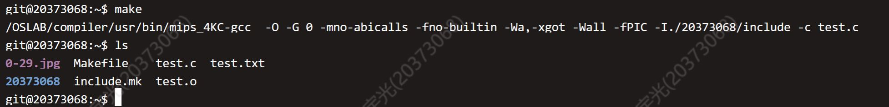
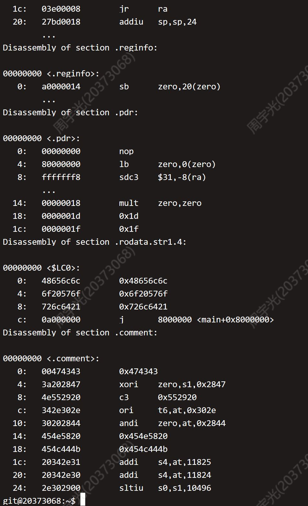

### Thinking 1.1

**请查阅并给出前述objdump 中使用的参数的含义。使用其它体系结构的编译器（如课程平台的MIPS交叉编译器）重复上述各步编译过程，观察并在实验报告中提交相应结果。**

objdump命令详解：

objdump -[参数] <文件>

参数有以下选项：

- -D 对所有section反汇编
- -S 输出C代码和反汇编指令共同存在并对照显示的格式
- -f 显示文件头信息
- -d 仅对需要执行的指令模块进行反汇编
- -h 显示代码模块的Header信息
- -x 显示全部Header信息
- -s 不仅显示全部Header信息，而且显示他们对应的十六进制文件代码
- -b 对二进制文件反汇编
- -m 支持的指令集架构
- -EB 和 -EL 指定大印第安或小印第安（大小端存储）

前述命令使用的是-DS，即对所有指令进行反汇编，而且输出C代码和反汇编指令共同存在并对照显示的格式。

文件位置可以是.o文件，也可以是二进制文件和可执行文件

我使用MIPS交叉编译器完成了汇编，方法如下：

- 注意到MIPS下，编译器并不能找到stdio.h，因此我把test.c的头文件删除掉了。
- 首先，构建交叉编译所用的一些变量，如CC、LD、CFLAGS等，写作include.mk
- 然后，在Makefile中写入交叉编译命令，用CC完成交叉编译，输出到test.o，最后再include上include.mk。
- 最后，命令行调用make，完成编译，生成MIPS架构的test.o，输出结果如下：

由于实验平台的objdump不支持对MIPS架构反汇编，所以我在助教的帮助下找到了服务器上对MIPS反汇编的objdump路径：

```/OSLAB/compiler/usr/mips-linux/bin/objdump```

因此，我可以通过执行命令 `/OSLAB/compiler/usr/mips-linux/bin/objdump -DS test.o` 而得到反汇编的结果。结果如下图所示：



### Thinking 1.2

**也许你会发现我们的readelf程序是不能解析之前生成的内核文件(内核文件是可执行文件)的，而我们之后将要介绍的工具readelf则可以解析，这是为什么呢？(提示：尝试使用readelf -h，观察不同)**

的确，用自己构建的readelf，不能够读取vmlinux文件，输出了

```Segmentation fault (core dumped)```

通过使用linux自带的readelf命令，我主要发现了以下三点问题：

- 第一，vmlinux和testELF的幻数不同。前者的幻数是

  `Magic:   7f 45 4c 46 01 02 01 00 00 00 00 00 00 00 00 00 `

  后者的幻数是

  `Magic:   7f 45 4c 46 01 01 01 00 00 00 00 00 00 00 00 00`

  两者的幻数有一位之差。

- 第二，两者的数据格式不同。vmlinux的数据格式是二进制，大印第安（大端存储），而testELF的格式是小印第安。

- 第三，也是我认为最重要的一点差别，就是二者编译时的体系架构不同。vmlinux由于是通过交叉编译器编译生成的，其Machine参数为MIPS R3000；而testELF是由服务器架构下的gcc生成的，其Machine参数为Intel 80386.

我认为，是第三点最重要的差别，导致二者之前两项差别的产生。同时，由于我们自己编写的readelf是在服务器的Intel 80386架构下生成的，没有考虑到MIPS ELF文件的问题，因此无法读取vmlinux文件的内容。

### Thinking 1.3

**在理论课上我们了解到，MIPS  体系结构上电时，启动入口地址为0xBFC00000（其实启动入口地址是根据具体型号而定的，由硬件逻辑确定，也有可能不是这个地址，但一定是一个确定的地址），但实验操作系统的内核入口并没有放在上电启动地址，而是按照内存布局图放置。思考为什么这样放置内核还能保证内核入口被正确跳转到？**

**（提示：思考实验中启动过程的两阶段分别由谁执行。）**

我认为，这是因为实验中使用的是GXemul仿真，而这个仿真已经帮我们把启动的第一阶段——不涉及操作系统内核的BootLoader阶段——做完了，已经直接跳转到操作系统内核位置了。所以表面上，上电后就直接正确跳转到了内核位置。而实际上，是GXemul帮我们实现了这个步骤。

### Thinking 1.4

**与内核相比，普通进程的sg_size 和bin_size  的区别在于它的开始加载位置并非页对齐，同时bin_size的结束位置（va+i，其中i为计算出的该段在ELF文件中的大小）也并非页对齐，最终整个段加载完毕的sg_size  末尾的位置也并非页对齐。请思考，为了保证页面不冲突（不重复为同一地址申请多个页，以及页上数据尽可能减少冲突），这样一个程序段应该怎样加载内存空间中。**

不要按照页表为单位进行加载，而细分为比页表更小的单位进行加载，我想这样可能可以吧。

### Thinking 1.5

**内核入口在什么地方？main 函数在什么地方？我们是怎么让内核进入到想要的 main 函数的呢？又是怎么进行跨文件调用函数的呢？** 

内核入口位于KERNBASE的0x80010000处，而main函数位于这个位置之后。

要让内核进入main函数，需要在start.S使用jal，跳转到main函数的地址。

调用其他文件的函数，需要先保存当前地址和当前程序状态到栈中，然后用jal跳转到其他文件函数，最后再释放栈中的数据，恢复函数现场。

### Thinking 1.6

**查阅《See MIPS Run Linux》一书相关章节，解释boot/start.S 中下面几行对CP0 协处理器寄存器进行读写的意义。具体而言，它们分别读/写了哪些寄存器的哪些特定位，从而达到什么目的？**

```assembly
/* Disable interrupts */
mtc0 zero, CP0_STATUS
......
/* disable kernel mode cache */
mfc0 t0, CP0_CONFIG
and t0, ~0x7
ori t0, 0x2
mtc0 t0, CP0_CONFIG
```

- mtc0	s, <n> 是将数据传入协处理器中的一个寄存器；
- mfc0	d, <n> 是从协处理器中的某寄存器取出数据；

这两条指令是设置/查看控制寄存器值的唯一方法。

具体到start.S中的指令，涉及到了两个CP0寄存器：STATUS寄存器和CONFIG寄存器。前者的作用是记录处理器状态和控制，比如当其中的EXL位为1时，就会进入中断模式；后者的作用是配置CPU，设置CPU的一些参数。

第一条指令` mtc0	zero, CP0_STATUS `是将CP0协处理器中的状态寄存器设置为0.这样操作的目的是关闭中断机制，让系统进入内核态。

第2-5条指令首先取出了CP0_CONFIG的值，然后将此值与（0x7的取反）进行与运算，将后三位清零；接着和0x2进行或运算，后三位被设置为了 $010_b$；最后，将这个设置好的CONFIG值传回给CP0_CONFIG寄存器。这样操作的目的是禁用kseg0区（内核）的高速缓存。

### 附录（给自己看的）

代码：

./drivers/gxconsole/console.c

```c
/*
*  $Id: hello.c,v 1.3 2006/05/22 04:53:52 debug Exp $
*
*  GXemul demo:  Hello World
*
*  This file is in the Public Domain.
*/

#include "dev_cons.h"

/*  Note: The ugly cast to a signed int (32-bit) causes the address to be
    sign-extended correctly on MIPS when compiled in 64-bit mode  */
#define PHYSADDR_OFFSET     ((signed int)0x80000000)


#define PUTCHAR_ADDRESS     (PHYSADDR_OFFSET +      \
                DEV_CONS_ADDRESS + DEV_CONS_PUTGETCHAR)
#define HALT_ADDRESS        (PHYSADDR_OFFSET +      \
                DEV_CONS_ADDRESS + DEV_CONS_HALT)


void printcharc(char ch)
{
    *((volatile unsigned char *) PUTCHAR_ADDRESS) = ch;
}


void halt(void)
{
    *((volatile unsigned char *) HALT_ADDRESS) = 0;
}

void printstr(char *s)
{
    while (*s)
        printcharc(*s++);
}
```

./lib/print.c

```c
/*
 * Copyright (C) 2001 MontaVista Software Inc.
 * Author: Jun Sun, jsun@mvista.com or jsun@junsun.net
 *
 * This program is free software; you can redistribute  it and/or modify it
 * under  the terms of  the GNU General  Public License as published by the
 * Free Software Foundation;  either version 2 of the  License, or (at your
 * option) any later version.
 *
 */

#include    <print.h>

/* macros */
#define     IsDigit(x)  ( ((x) >= '0') && ((x) <= '9') )
#define     Ctod(x)     ( (x) - '0')

/* forward declaration */
extern int PrintChar(char *, char, int, int);
extern int PrintString(char *, char *, int, int);
extern int PrintNum(char *, unsigned long, int, int, int, int, char, int);

/* private variable */
static const char theFatalMsg[] = "fatal error in lp_Print!";

/* -*-
 * A low level printf() function.
 */
void
lp_Print(void (*output)(void *, char *, int),
     void * arg,
     char *fmt,
     va_list ap)
{

#define     OUTPUT(arg, s, l)  \
  { if (((l) < 0) || ((l) > LP_MAX_BUF)) { \
  { if (((l) < 0) || ((l) > LP_MAX_BUF)) { \
       (*output)(arg, (char*)theFatalMsg, sizeof(theFatalMsg)-1); for(;;); \
    } else { \
      (*output)(arg, s, l); \
    } \
  }

    char buf[LP_MAX_BUF];

    char c;
    char *s;
    long int num;

    int longFlag;
    int negFlag;
    int width;
    int prec;
    int ladjust;
    char padc;

    int length;

    for(;;) {
    {
        /* scan for the next '%' */
        /* flush the string found so far */

        /* are we hitting the end? */
    }

    /* we found a '%' */

    /* check for long */
    negFlag = 0;
    switch (*fmt) {
     case 'b':
        if (longFlag) {
        num = va_arg(ap, long int);
        } else {
        num = va_arg(ap, int);
        }
        length = PrintNum(buf, num, 2, 0, width, ladjust, padc, 0);
        OUTPUT(arg, buf, length);
        break;

     case 'd':
     case 'D':
        if (longFlag) {
        num = va_arg(ap, long int);
        } else {
        num = va_arg(ap, int);
        }
        if (num < 0) {
        num = - num;
        negFlag = 1;
        }
        length = PrintNum(buf, num, 10, negFlag, width, ladjust, padc, 0);
        OUTPUT(arg, buf, length);
        break;

     case 'o':
     case 'O':
        if (longFlag) {
        num = va_arg(ap, long int);
        } else {
        num = va_arg(ap, int);
        }
        length = PrintNum(buf, num, 8, 0, width, ladjust, padc, 0);
        OUTPUT(arg, buf, length);
        break;

     case 'u':
     case 'U':
        if (longFlag) {
        num = va_arg(ap, long int);
        } else {
        num = va_arg(ap, int);
        }
        length = PrintNum(buf, num, 10, 0, width, ladjust, padc, 0);
        OUTPUT(arg, buf, length);
        break;

     case 'x':
        if (longFlag) {
        num = va_arg(ap, long int);
        } else {
        num = va_arg(ap, int);
        }
        length = PrintNum(buf, num, 16, 0, width, ladjust, padc, 0);
        OUTPUT(arg, buf, length);
        break;

     case 'X':
        if (longFlag) {
        num = va_arg(ap, long int);
        } else {
        num = va_arg(ap, int);
        }
        length = PrintNum(buf, num, 16, 0, width, ladjust, padc, 1);
        OUTPUT(arg, buf, length);
        break;

     case 'c':
        c = (char)va_arg(ap, int);
        length = PrintChar(buf, c, width, ladjust);
        OUTPUT(arg, buf, length);
        break;

     case 's':
        s = (char*)va_arg(ap, char *);
        length = PrintString(buf, s, width, ladjust);
        OUTPUT(arg, buf, length);
        break;

     case '\0':
        fmt --;
        break;

     default:
        /* output this char as it is */
        OUTPUT(arg, fmt, 1);
    }   /* switch (*fmt) */

    fmt ++;
    }       /* for(;;) */

    /* special termination call */
    OUTPUT(arg, "\0", 1);
}


/* --------------- local help functions --------------------- */
int
PrintChar(char * buf, char c, int length, int ladjust)
{
    int i;

    if (length < 1) length = 1;
    if (ladjust) {
    *buf = c;
    for (i=1; i< length; i++) buf[i] = ' ';
    } else {
    for (i=0; i< length-1; i++) buf[i] = ' ';
    buf[length - 1] = c;
    }
    return length;
}

int
PrintString(char * buf, char* s, int length, int ladjust)
{
    int i;
    int len=0;
    char* s1 = s;
    while (*s1++) len++;
    if (length < len) length = len;

    if (ladjust) {
    for (i=0; i< len; i++) buf[i] = s[i];
    for (i=len; i< length; i++) buf[i] = ' ';
    } else {
    for (i=0; i< length-len; i++) buf[i] = ' ';
    for (i=length-len; i < length; i++) buf[i] = s[i-length+len];
    }
    return length;
}

int 
PrintNum(char * buf, unsigned long u, int base, int negFlag,
     int length, int ladjust, char padc, int upcase)
{
    /* algorithm :
     *  1. prints the number from left to right in reverse form.
     *  2. fill the remaining spaces with padc if length is longer than
     *     the actual length
     *     TRICKY : if left adjusted, no "0" padding.
     *          if negtive, insert  "0" padding between "0" and number.
     *  3. if (!ladjust) we reverse the whole string including paddings
     *  4. otherwise we only reverse the actual string representing the num.
     */
    int actualLength =0;
    char *p = buf;
    int i;

    do {
    int tmp = u %base;
    if (tmp <= 9) {
        *p++ = '0' + tmp;
    } else if (upcase) {
        *p++ = 'A' + tmp - 10;
    } else {
        *p++ = 'a' + tmp - 10;
    }
    u /= base;
    } while (u != 0);

    if (negFlag) {
    *p++ = '-';
    }

    /* figure out actual length and adjust the maximum length */
    actualLength = p - buf;
    if (length < actualLength) length = actualLength;

    /* add padding */
    if (ladjust) {
    padc = ' ';
    }
    if (negFlag && !ladjust && (padc == '0')) {
    for (i = actualLength-1; i< length-1; i++) buf[i] = padc;
    buf[length -1] = '-';
    } else {
    for (i = actualLength; i< length; i++) buf[i] = padc;
    }


    /* prepare to reverse the string */
    {
    int begin = 0;
    int end;
    if (ladjust) {
        end = actualLength - 1;
    } else {
        end = length -1;
    }

    while (end > begin) {
        char tmp = buf[begin];
        buf[begin] = buf[end];
        buf[end] = tmp;
        begin ++;
        end --;
    }
    }

    /* adjust the string pointer */
    return length;
}
```

./lib/printf.c

```c
/*
 * Copyright (C) 2001 MontaVista Software Inc.
 * Author: Jun Sun, jsun@mvista.com or jsun@junsun.net
 *
 * This program is free software; you can redistribute  it and/or modify it
 * under  the terms of  the GNU General  Public License as published by the
 * Free Software Foundation;  either version 2 of the  License, or (at your
 * option) any later version.
 *
 */

#include <printf.h>
#include <print.h>
#include <drivers/gxconsole/dev_cons.h>


void printcharc(char ch);

void halt(void);

static void myoutput(void *arg, char *s, int l)
{
    int i;

    // special termination call
    if ((l==1) && (s[0] == '\0')) return;

    for (i=0; i< l; i++) {
    printcharc(s[i]);
    if (s[i] == '\n') printcharc('\n');
    }
}

void printf(char *fmt, ...)
{
    va_list ap;
    va_start(ap, fmt);
    lp_Print(myoutput, 0, fmt, ap);
    va_end(ap);
}

void
_panic(const char *file, int line, const char *fmt,...)
{
    va_list ap;


    va_start(ap, fmt);
    printf("panic at %s:%d: ", file, line);
    lp_Print(myoutput, 0, (char *)fmt, ap);
    printf("\n");
    va_end(ap);


    for(;;);
}
```

