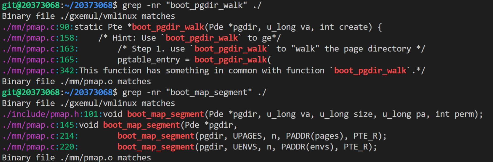
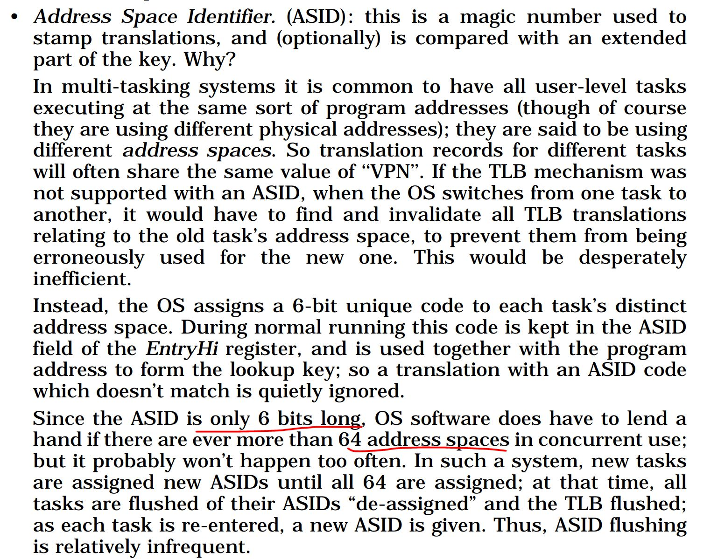
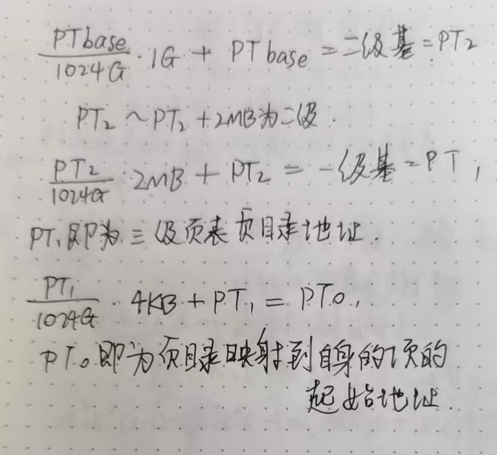
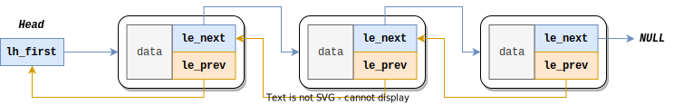
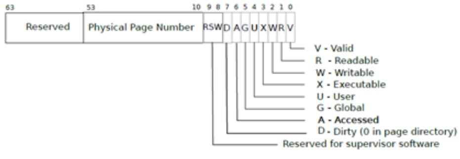
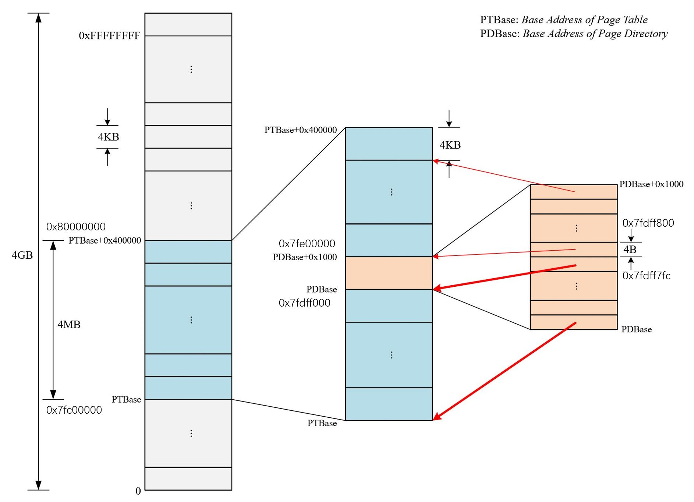
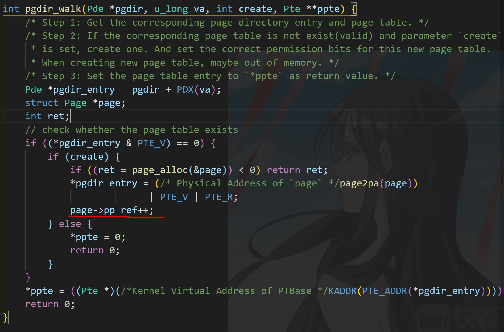
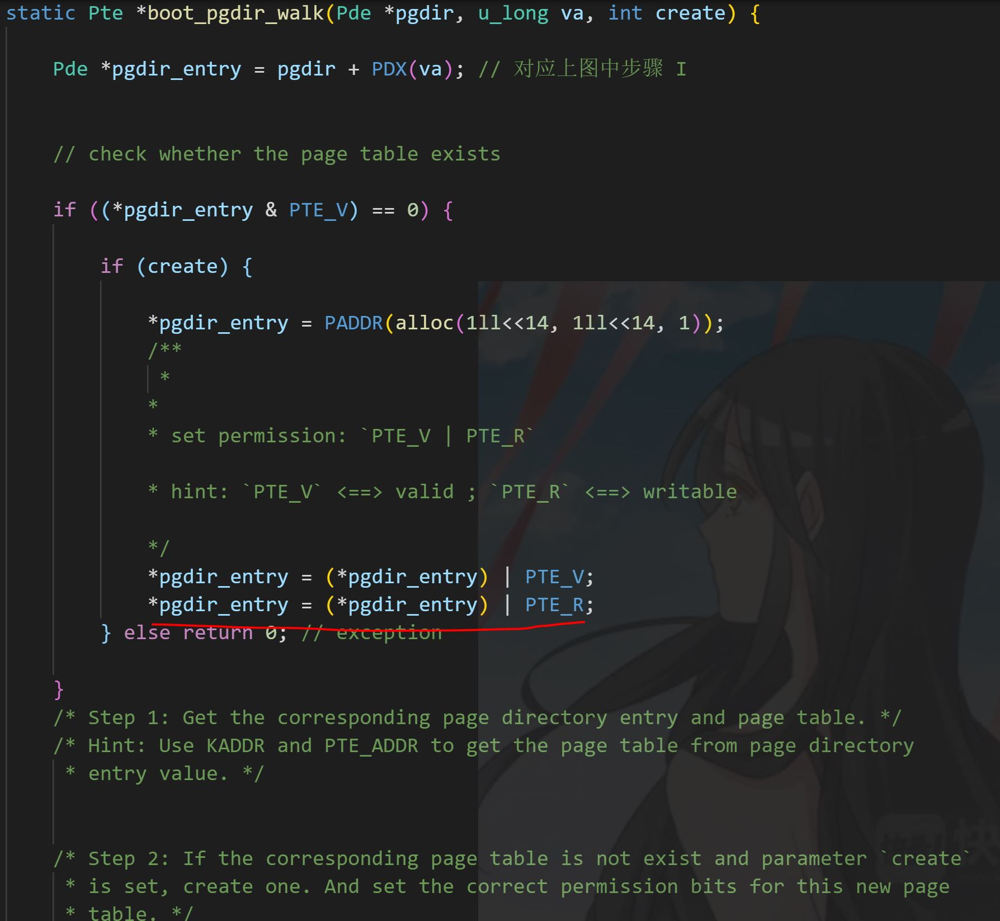
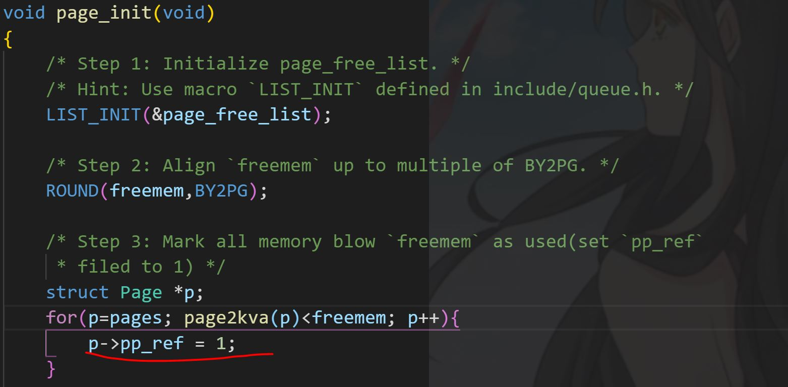

# lab2实验报告

20373068 周宇光

## 一、实验思考题

**Thinking 2.1 
请你根据上述说明，回答问题：**

- **在我们编写的程序中，指针变量中存储的地址是虚拟地址还是物理地址？**
- **MIPS 汇编程序中lw, sw使用的是虚拟地址还是物理地址？**

指针变量存储的是虚拟地址。

在计组课设中，使用MARS模拟器进行的lw、sw是物理地址；在操作系统中，使用的lw和sw是虚拟地址。

**Thinking 2.2**

- **请从可重用性的角度，阐述用宏来实现链表的好处。**
- **请你查看实验环境中的 /usr/include/sys/queue.h，了解其中单向链表与循环链表的实现，比较它们与本实验中使用的双向链表，分析三者在插入与删除操作上的性能差异。**

用宏来实现链表之后，当其他模块想使用链表时，可以直接调用这个头文件的链表实现，最后由编译器来完成代码的扩展操作。各种结构体的定义名称，也不需要提前固定好，其他文件想创建自己的链表时，也可以自己去修改链表的名称、LIST_ENTRY的名称等。这样的操作使得这部分链表的代码不至于在各个文件中反复出现，增加了可重用性。

对比本实验使用的queue.h中的LIST（双向链表）与/usr/include/sys目录下的queue.h下，STAILQ（循环链表）和SIMPLEQ（单向链表）的实现，发现

- 头部插入操作：三者性能相同
- 尾部插入操作：循环链表最快，单向链表通过添加了尾部指针也变得很快，双向链表需要遍历整个链表，比较慢
- 向后插入操作：三者性能相同
- 向前插入操作：双向链表很快，而由于效率原因，单向链表和循环链表没有这个操作

**Thinking 2.3**

**请阅读 `include/queue.h` 以及 `include/pmap.h`, 将 `Page_list` 的结构梳理清楚，选择正确的展开结构。**

```c
struct Page_list{
    struct Page{
        struct {
            struct Page *le_next;
            struct Page **le_prev;
        } pp_link;
        u_short pp_ref;
    }* lh_first;
}
```

- page_free_list为Page_list类型的变量
- head对应Page_list类型的变量
- elm对应Page类型的lh_first指针变量
- field对应pp_link变量

mips_vm_init()用到的内存为[0x80400000, freemem − 1]

**Thinking 2.4** 

**请你寻找上述两个 boot_\* 函数在何处被调用。**

boot_pgdir_walk()函数被boot_map_segment调用。

boot_map_segment()函数被mips_vm_init()调用，用来在启动vmlinux时初始化内存分配。

**Thinking 2.5 请你思考下述两个问题：**

- 请阅读上面有关 R3000-TLB 的叙述，从虚拟内存的实现角度，阐述 ASID 的必要性

  虚拟内存需要管理多个进程，每个进程都保留一个自己的完整地址空间。对于不同的地址空间，即便是同样的虚拟地址，其映射的物理内存的位置也完全有可能是不同的。甚至，有可能有的虚拟地址映射的部分都不在内存中，而在磁盘中！因此，需要用ASID来区分开不同的地址空间，以此来实现多进程的地址管理。

- 请阅读《IDT R30xx Family Software Reference Manual》的 Chapter 6，结合 ASID 段的位数，说明 R3000 中可容纳不同的地址空间的最大数量

  ASID的位数是6位，因此理论上最大可以容纳$2^6=64$种不同的地址空间。事实上，当超过64种地址空间时，操作系统会帮忙解决这个问题的。但这种情况并不经常发生，一般而言，64种地址空间已经足够使用了。

**Thinking 2.6 请你完成如下三个任务：** 

- **tlb_invalidate 和 tlb_out 的调用关系是怎样的？**

  tlb_invalidate调用了tlb_out。

- **请用一句话概括 tlb_invalidate 的作用**

  用来清除va在tlb中对应的物理地址映射。

- **逐行解释 tlb_out 中的汇编代码** 

  ```assembly
  /* Exercise 2.10 */
  LEAF(tlb_out)
  //1: j 1b
  nop
  	mfc0	k1,CP0_ENTRYHI		//将CP0中ENTRYHI寄存器的值赋给k1寄存器
  	mtc0	a0,CP0_ENTRYHI		//将CP0中ENTRYHI寄存器赋为a0寄存器的值
  	nop						   //流水线结构导致必须的nop
  	// insert tlbp or tlbwi
  	tlbp 					   //根据a0寄存器赋给ENTRYHI的值，查找TLB表项，并将表项索引存入index寄存器
  	nop
  	nop
  	nop
  	nop						   //流水线结构导致必须的nop
  	mfc0	k0,CP0_INDEX         //将获取到的TLB表项索引取出，转移到k0寄存器
  	bltz	k0,NOFOUND           //如果表项小于0（最高位置为1），则说明TLB缺失，跳转到NOFOUND部分的代码
  	nop
  	mtc0	zero,CP0_ENTRYHI
  	mtc0	zero,CP0_ENTRYLO0
  	nop						   //流水线结构导致必须的nop
  	// insert tlbp or tlbwi
  	tlbwi			     	   //将之前传入ENTRYHI的a0寄存器传入参数，和之前的ENTRYLO的值，写到CP0_INDEX的值对应的TLB表项中
  NOFOUND:
  
  	mtc0	k1,CP0_ENTRYHI      //如果没有找到对应的TLB表项，则直接把之前的CP0_ENTRYHI的值赋回来，等于什么也没有做；如果找到了对应的TLB表项，则清空该TLB表项。
  	
  	j	ra					  //退出函数
  	nop
  END(tlb_out)
  ```

**Thinking 2.7** 

**在现代的 64 位系统中，提供了 64 位的字长，但实际上不是 64 位页式存储系统。假设在 64 位系统中采用三级页表机制，页面大小 4KB。由于 64 位系统中字长为 8B，且页目录也占用一页，因此页目录中有 512 个页目录项，因此每级页表都需要 9 位。因此在 64 位系统下，总共需要 3 × 9 + 12 = 39 位就可以实现三级页表机制，并不需要 64 位。现考虑上述 39 位的三级页式存储系统，虚拟地址空间为 512 GB，若记三级页表的基地址为 PTbase ，请你计算：**

- **三级页表页目录的基地址**

  一级页表：512个页目录项，每项8B，共计4KB

  二级页表：每个页表的大小为一页4KB，有512个页表，因此页表总大小为2MB。每个页表内有512个页表项，每项8B，管理4KB的空间。

  三级页表：以此类推，共有512*512=256K个页表，每个页表4KB，因此总共空间为1GB。最小的页表项有512×512×512=128M个，每个页表项管理4KB的空间，因此总计可以管理1024GB=2^40大小的空间。

- **映射到页目录自身的页目录项(自映射)**

  整题的解答如下：

**Thinking 2.8** **任选下述二者之一回答：**

- **简单了解并叙述 X86 体系结构中的内存管理机制，比较 X86 和 MIPS 在内存管理上的区别。**==√==
- **简单了解并叙述 RISC-V 中的内存管理机制，比较 RISC-V 与 MIPS 在内存管理上的区别。**

x86结构的内存管理机制与MIPS类似，都采用段页式内存管理，页表中都是采用多级页表机制。

二者的差别主要在TLB不命中的处理上，对于x86，TLB不命中时，会由MMU硬件完成访问主存并填充TLB的工作；而对于MIPS，会出发TLB缺失异常，交给操作系统来处理，操作系统将该索引的信息填入TLB。

## 二、实验难点图示

### 1、有关链表宏函数的定义

当我阅读代码的时候，碰到了一个疑惑点：field是什么？后来发现，field是一个可传入的结构体名称，具体到本实验中，field是结构体名称pp_link。这样使用宏定义，有助于为不同的结构体名称服务，增强代码的可扩展性。不过需要注意，在宏函数中，field左右不能加括号！不然会解析错误parse error。

另外，链表的写法也让我学到了一些新方法。这里实现的其实是一个伪双向链表，另一个指针域prev其实是《指向自身指针的指针》，即`*(elm->field.le_prev)=elm`恒成立。这样的指针可以帮助我们简化一些插入删除操作。这块需要仔细理解指导书上的图，prev指向的域不是一个struct Page，而是一个le_next指针。

### 2、页表项权限位的含义

每个PTE都包含一些标志位，告诉分页硬件如何允许使用关联的虚拟地址。PTE_V表示PTE是否存在：如果未设置，对页面的引用会导致错误（即不允许）。PTE_R控制是否允许指令读取页。PTE_W控制是否允许指令写入页。PTE_X控制CPU是否可以将页面内容解释为指令并执行它们。PTE_U控制是否允许用户模式下的指令访问页面；如果未设置PTE_U，则PTE只能在管理员模式下使用。其具体位置如下图所示：

### 3、关于地址访存

CPU解引用时使用的是虚拟地址！C语言中的解引用操作*(addr)，会被汇编翻译成lw指令，二者使用的地址都是虚拟地址。CPU会完成kseg1段虚拟地址向物理地址的映射（因为这段只需要高位去0即可，不用TLB，cache啥的麻烦事）

### 4、自引用页表的页目录位置分析

这块实在是给我算了好久，在此记录一下自己的计算思路。

一个页表项的大小为4B，能管理4KB的内存（一页框）

一个页表有1024个页表项，因此一个页表的大小为4KB，能管理4MB的内存

如果要管理4GB的内存空间，则需要4GB/4KB=1M个页表项，即1K个页表。因此，管理4GB的空间需要的页表大小为4MB，1024个页表。

为了管理上述的1024个页表，建立一个页目录（二级页表机制），一个页目录需要1024个页表项，大小为4B*1024=4KB的空间。

然而，在MOS中，1024个二级页表在主存中占据的空间其实也被二级页表自身映射过了！1024个页表的大小是4MB，其实已经被二级页表自己中的某一个页表映射到了（页表的大小是4KB，管理的4MB空间，正好等于1024个页表的大小），即这一个特殊的二级页表其实就是页目录。所以，4MB完全包含了页表和页目录。具体的页表结构如下图所标识：

## 三、体会与感想

本次实验难度比lab1有所增加，需要我们阅读大量代码，实现宏函数，完成内存操作的函数，不仅对我们内存管理的知识进行了深度考察，乃至于对我们C语言基础进行了挑战。本次实验的工作量较大，我通过了3天的工作才完成了这次OS实验。

## 四、指导书反馈

1、在内存管理一章的物理内存管理一节，链表宏的小节内容中，说链表宏实际上实现的是双向链表。这给我的理解带来了困惑，让我以为le_next是前项指针，那le_prev就是后向指针。但实际上，这并不是双向链表，le_prev不过是一个“指针的指针”而已。

2、在指导书上，pgdir_walk()的实现框架并没有提示我们要更新pp_ref。经过其他系大佬的指点，我才知道这个函数需要多一个page->pp_ref++，才能通过课下测试。具体如下图所示：

我猜测，这行语句的含义是每当正常状态下用户访问到二级页表项，其访问次数应当增加一次，该页框对应的pp_ref就需要加一。这样的加一操作有助于我们以后实现页面置换算法，统计各个页面的访问频次。而对于与pgdir_walk()类似的boot_pgdir_walk()函数中，并没有这个pp_ref++语句。

我猜测原因是内核启动过程中会调用page_init函数，而此函数将所有的非空闲内存块的pp_ref已经置为了1：

因此，在boot_pgdir_walk中，就不必多此一举了。