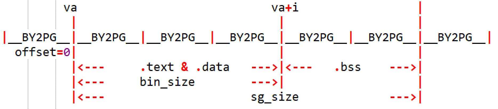

# lab3实验报告

20373068 周宇光

## 一、实验思考题

**Thinking 3.1**

**思考envid2env 函数:**

**为什么envid2env 中需要判断e->env_id != envid 的情况？如果没有这步判断会发生什么情况？**

因为取env数组位置时，应当给envid加上ENVX这个宏，来确保其在NENV限制的进程数量范围之内。

而如果有一些不法分子，其envid超出了NENV的限制，这就有可能访问到一些错误的进程位置。此时，应对这些不法分子予以惩治，不能让其用超出NENV限制的进程id，访问到真正正在进行的进程。所以，要判断一下，是否e->envid == envid。

**Thinking 3.2**

 **结合include/mmu.h 中的地址空间布局，思考env_setup_vm 函数：**

**• UTOP 和ULIM 的含义分别是什么，UTOP 和ULIM 之间的区域与UTOP以下的区域相比有什么区别？**

**• 请结合系统自映射机制解释Step4中pgdir[PDX(UVPT)]=env_cr3的含义。**

**• 谈谈自己对进程中物理地址和虚拟地址的理解。**

UTOP往上是ENVS结构体的存储区域，往下是一些用户栈的区域。ULIM往上是中断处理相关的区域，往下是用户VPT、页表结构体的存储区域。UTOP以下的区域是一页一页管理的（BY2PG），而UTOP以上到ULIM的区域是1个4M1个4M管理的（PDMAP）。

env_cr3对应着页目录的物理地址，而pgdir[PDX(UVPT)]对应页目录的页目录项。因此将页目录的页目录项写为页目录的地址，完成自映射，并将其权限位设置为不可写而可读。

对于每个进程，物理地址都是相同的；而每个进程都有一套自己的虚拟地址，即便是同一个虚拟地址，如果在不同的进程中，也可能映射到不同的物理地址。

**Thinking 3.3** **找到 user_data 这一参数的来源，思考它的作用。没有这个参数可不可以？为什么？（可以尝试说明实际的应用场景，举一个实际的库中的例子）**

user_data这个参数的值为目标进程的进程控制块，传入这个参数是为了给内层函数传值，不可省缺。比如stdlib.h的qsort函数，其中有一个size_t width参数，就是为了给内层调用的compare函数提供信息。

**Thinking 3.4 结合load_icode_mapper 的参数以及二进制镜像的大小，考虑该函数可能会面临哪几种复制的情况？你是否都考虑到了？** 

首先，判断bin_size的开头va是否卡在页面中间（没有页对齐）。如果没有，则还需要判断这个页面是否已经被申请过。

然后，需要判断bin_size的结尾是否页对齐。不能写超出范围。

接着，需要判断sgsize的开头是否页对齐，决定是否申请新页面

最后，判断sgsize的结尾是否页对齐，防止越界访问。

**Thinking 3.5 思考上面这一段话，并根据自己在lab2 中的理解，回答：**

**•** **你认为这里的 env_tf.pc 存储的是物理地址还是虚拟地址?**

**• 你觉得entry_point其值对于每个进程是否一样？该如何理解这种统一或不同？**

在kernelelf.h中，是这样描述这个赋值的：

```c
	Elf32_Addr	e_entry;		/* Entry point virtual address */
```

因此，存储的必须是虚拟地址。从理论上也可以解释，因为CPU执行时并不知道物理地址是什么，只知道虚拟地址，由硬件和MMU来完成地址转换。

entry_point是一样的。这样对CPU而言比较方便，每次都从同一虚拟地址开始执行；而不同进程的同一虚拟地址也可以映射到不同的物理地址，彼此也不会打架。

**Thinking 3.6** **请查阅相关资料解释，上面提到的epc是什么？为什么要将env_tf.pc设置为epc呢？**

这个epc是指CP0协处理器的epc寄存器，其存放的是中断或异常的那个PC地址。因此，需要将CPU上下文的tf.pc存为epc。

**Thinking 3.7** **关于 TIMESTACK，请思考以下问题：**

**•** **操作系统在何时将什么内容存到了 TIMESTACK 区域**

**•** **TIMESTACK 和 env_asm.S 中所定义的 KERNEL_SP 的含义有何不同**

在时钟中断时，操作系统将存放CPU寄存器的栈的栈顶地址存到了TIMESTACK区域。

TIMESTAKCK是时钟中断时固定的栈顶地址，KERNEL_SP是其他中断时的栈顶地址。

**Thinking 3.8** **试找出上述 5 个异常处理函数的具体实现位置。**

- handle_int的实现位于lib/genex.S的第48行，NESTED(handle_int, TF_SIZE, sp)
- handle_mod的实现位于lib/genex.S的第159行，BUILD_HANDLER mod  page_fault_handler cli
- 两个handle_tlb的实现位于lib/genex.S的第158行，BUILD_HANDLER tlb  do_refill  cli
- handle_sys的实现位于lib/syscall.S的第8行，NESTED(handle_sys,TF_SIZE, sp)

**Thinking 3.9** **阅读 kclock_asm.S 和 genex.S 两个文件，并尝试说出 set_timer 和time_irq 函数中每行汇编代码的作用**

```assembly
LEAF(set_timer)

	li t0, 0xc8
	sb t0, 0xb5000100
	# 每秒中断200次
	sw	sp, KERNEL_SP
	# 将栈指针存到KERNEL_SP的内存区域中
setup_c0_status STATUS_CU0|0x1001 0
	# cp0寄存器的cu0被设置为0x10001001
	# 28位是1表示允许在用户模式下用cp0
	# 12位是1表示可以响应四号中断
    # 低两位为01，表示当前处于用户态且中断开启
	jr ra

	nop
END(set_timer)
```

```assembly
timer_irq:

	sb zero, 0xb5000110
	# 禁止时钟中断
1:	j	sched_yield
	# 跳转到调度函数，决定哪个进程执行
	nop
	/*li t1, 0xff
	lw    t0, delay
	addu  t0, 1
	sw	t0, delay
	beq	t0,t1,1f	
	nop*/
	j	ret_from_exception
	# 结束异常处理程序
	nop
```

**Thinking 3.10 阅读相关代码，思考操作系统是怎么根据时钟周期切换进程的。**

OS通过设置每秒钟的时钟中断次数，来决定每个进程占用时间块的大小。

当时间块用完后，OS会挂起进程，调用sched_yield来切换另一个进程执行。

由此，便实现了根据时钟周期的进程切换。

## 二、实验难点图示

我觉得本实验的主要难点在于lab3-1中，load_icode_mapper函数的编写。这块需要认识清楚，一共有多少种页不对齐的可能性。

需要判断的位置有三个，每个位置都有对齐或不对齐，两种可能。如果都是页对齐的，这是最好处理的情况，如下图所示：



然而，很有可能有一些位置出现不对齐的情况。下面列举了其中的几种，有一个位置、两个位置、三个位置不对齐的类型：


实际上，并不用按照$2^3=8$中情况分类讨论去编程，只需要在每一个节点都判断一下，是否页对齐即可。如果是页对齐，则直接开始下一步；如果不是页对齐，则进一步考虑下，本页有没有被申请过，前面有没有内容等等，细化处理即可。

## 三、体会与感想

本次实验我分两次完成的，lab3-1耗时1天，lab3-2耗时半天。总体难度尚可，lab3-1较难，lab3-2较为简单。lab3-1可能会反映出以前的一些bug，需要耐心寻找，不断用printf的方法来定位bug位置。

本次实验不只让我对进程及其调度过程有了具体的认识，而且巩固了我之前lab2的一些知识，填补了我的一些知识盲区。比如，本实验会涉及大量在0x80000000地址附近的宏，需要反复查阅mmu.h来了解这些宏，这无疑对我深化地址空间的认识有所帮助。

## 四、指导书反馈

无反馈，本次lab指导书的指导很有帮助。