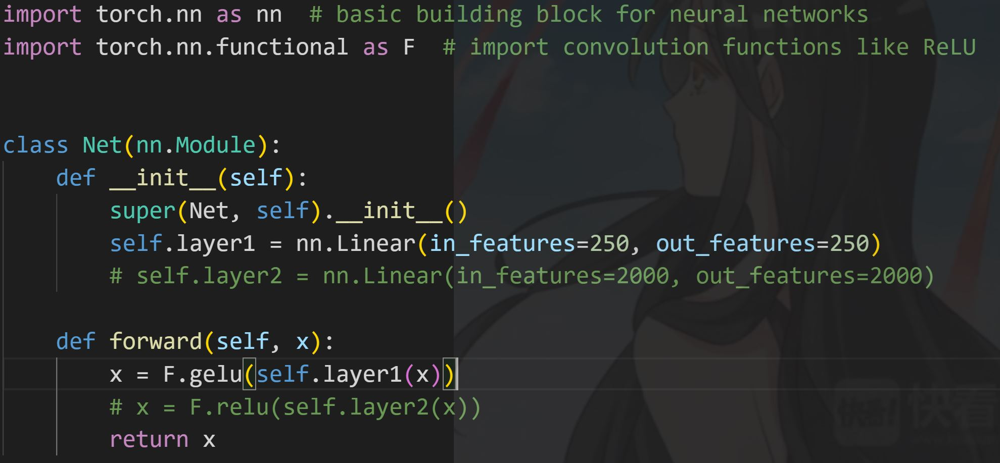
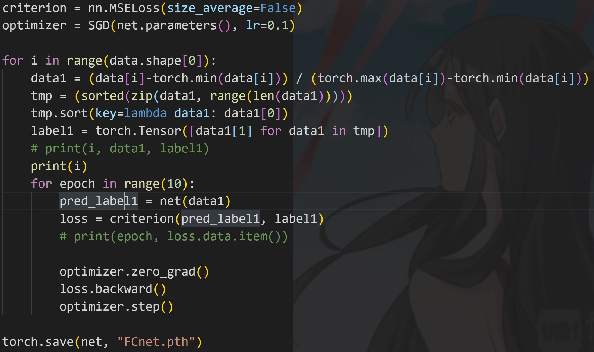
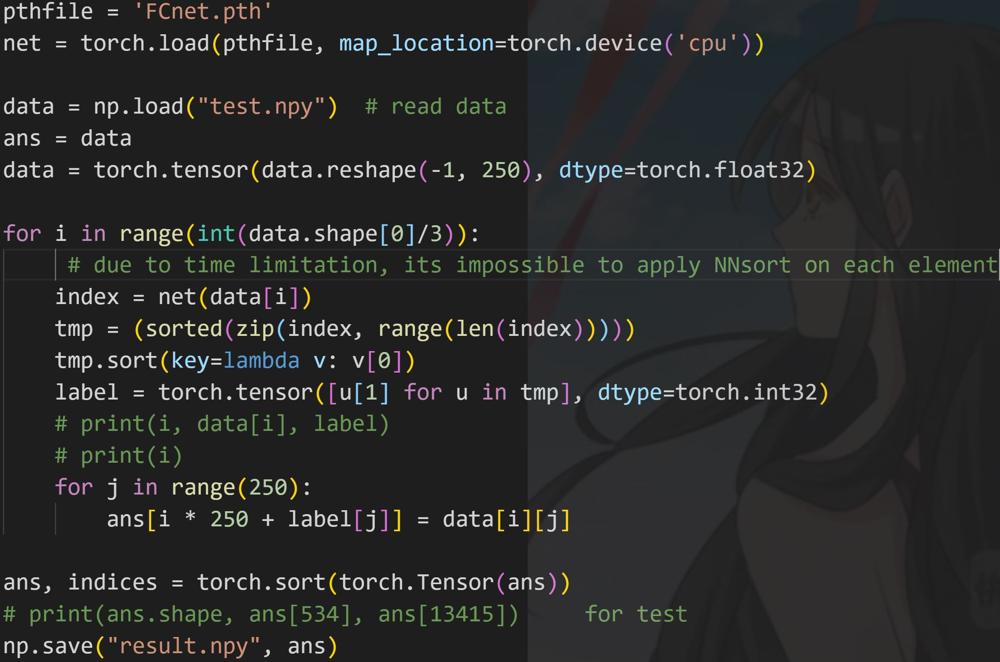

# lab4实验报告

20373068 周宇光

## 一、实验完成思路

那篇指导论文[1]有许多的细节无法实现，譬如如何动态调整全连接网络的输出宽度，如何确保输出结果的正确性等，可复现性似乎不高。除此之外，我还查到了一些别的神经网络排序的文献[2]，不过都是比较古老的，用硬件来完成的神经网络排序了，不适于在短时间之内完成。因此，我仅仅参考了一点点论文中反复过神经网络来减小待排序数组大小的思路，之后便我只好自己凭感觉搭网络了。

自己凭感觉搭网络可谓是非常艰难。首先，考虑到整个模型和代码文件的总计大小不能超过1M，因此我初步构思搭建规模较小的神经网络。由于论文[1]中论述了神经网络层数过深，将会导致模型输出结果不正确，无法保证梯度为正，小的输入获得小的输出。因此我最终设计了一个单层全连接层250-250映射，外接一个gelu激活函数的神经网络。网络的代码部分如下所示。

在构建好排序网络结构之后，我使用test.npy数据集，和torch自带的sort函数，对神经网络进行训练。由于神经网络的输入和输出维度都是250，因此我将数据分为20000组，每组在组内进行排序，将排序的结果作为标签，让神经网络迭代学习。迭代时，具体的参数我选择了0.1的学习率，和每组10次的迭代次数。经过训练，获得了用于排序的模型FCnet及其参数。具体实现如下图所示：

最后，将神经网络用于排序任务。由于这个神经网络的功能是对250个数排序，因此在实现时需要将5000000个待排序的数字分为20000组，对每组进行排序，然后将每组的排序结果归并——每组第一名放在一起，第二名放在一起，等等。归并后的数组只是完成了每250个数字的排序。不过在此基础上再进行传统的快速排序方法，应该会有一些性能的提升。不过经过实验发现，如果按照这个思路执行的话，仅仅是将5000000个数字过一遍神经网络的开销，就已经超出了时间限制。于是，我只好减少神经网络的工作量，让神经网络仅作用于前30%的数据。这样终于通过了评测。此部分实现代码如下图所示：

最终我取得了440s的好成绩。

## 二、体会与感想

本次实验需要自行探索，难度较大。我进行了3天左右的时间，才获得了一个差强人意的效果。不过通过本次实验也验证了，在一些传统问题上，神经网络等人工智能的先进算法并不一定能比经典方法有更好的效果，针对不同的问题还是应当用不同的方式解决，切忌生搬硬套机器学习模型。

## 三、实验反馈

本次实验比较缺乏指导，提供的论文可复现性也有些堪忧。如果能提供更全面的指导，或许这次实验能够收获更多。

## 四、参考文献

[1]NN-sort: Neural Network based Data Distribution-aware Sorting

[2]sorting networks and their applications

[3]learning neural networks that can sort